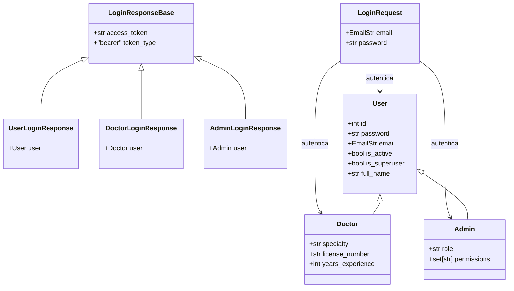

# Diagrama de clases: Flujos de Login

```mermaid
classDiagram
    class LoginRequest {
        +EmailStr email
        +str password
    }

    class LoginResponseBase {
        +str access_token
        +"bearer" token_type
    }

    class UserLoginResponse {
        +User user
    }

    class DoctorLoginResponse {
        +Doctor user
    }

    class AdminLoginResponse {
        +Admin user
    }

    class User {
        +int id
        +str password
        +EmailStr email
        +bool is_active
        +bool is_superuser
        +str full_name
    }

    class Doctor {
        +str specialty
        +str license_number
        +int years_experience
    }

    class Admin {
        +str role
        +set[str] permissions
    }

    LoginRequest --> User : autentica
    LoginRequest --> Doctor : autentica
    LoginRequest --> Admin : autentica

    LoginResponseBase <|-- UserLoginResponse
    LoginResponseBase <|-- DoctorLoginResponse
    LoginResponseBase <|-- AdminLoginResponse

    User <|-- Doctor
    User <|-- Admin
```
